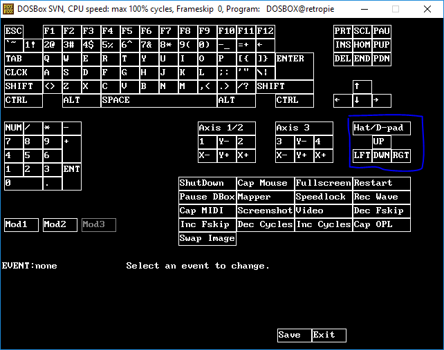

# My Retropie Stuff <!-- omit in toc -->

- [1. Scripts](#1-scripts)
  - [1.1. Parada de Emulation Station](#11-parada-de-emulation-station)
  - [1.2. Arranque de Emulation Station](#12-arranque-de-emulation-station)
  - [1.3. Normalizador de imágenes de carátulas](#13-normalizador-de-imágenes-de-carátulas)
  - [1.4. Añadir borde rojo a las imágenes JPG](#14-añadir-borde-rojo-a-las-imágenes-jpg)
  - [1.5. Configuración de un juego para DOSbox](#15-configuración-de-un-juego-para-dosbox)
- [2. Procedimientos](#2-procedimientos)
  - [2.1. Alta de juegos en DOSbox](#21-alta-de-juegos-en-dosbox)
    - [2.1.1. **Preparación general de Emulation Station**](#211-preparación-general-de-emulation-station)
    - [2.1.2. **Preparación de los directorios del juego**](#212-preparación-de-los-directorios-del-juego)
    - [2.1.3. **Instalación del juego**](#213-instalación-del-juego)
    - [2.1.4. **Mapeo de botones y sticks**](#214-mapeo-de-botones-y-sticks)
      - [2.1.4.1. **Mapeo de botones y sticks con el keymapper de DOSbox**](#2141-mapeo-de-botones-y-sticks-con-el-keymapper-de-dosbox)
      - [2.1.4.2. **Mapeo de botones y sticks con Linux Joystick Mapper**](#2142-mapeo-de-botones-y-sticks-con-linux-joystick-mapper)
    - [2.1.5. **Configuración del juego**](#215-configuración-del-juego)

## 1. Scripts

### 1.1. Parada de Emulation Station

|Concepto|Descripción|
|-|-|
|Utilidad|Parada de Emulation Station desde Putty|
|Script en el repo|[scripts/stop_emulationstation.sh](scripts/stop_emulationstation.sh)|
|Dependencias|[https://github.com/crcerror/ES-generic-shutdown](https://github.com/crcerror/ES-generic-shutdown)<p>[scripts\ES-generic-shutdown-master.zip](scripts\ES-generic-shutdown-master.zip)|
|Ubicación en SO|~/utils/|
|Enlace|/usr/bin/stop_es|

### 1.2. Arranque de Emulation Station

|Concepto|Descripción|
|-|-|
|Utilidad|Arranque de ES desde Putty|
|Script en el repo|[scripts/restart_emulationstation.sh](scripts/restart_emulationstation.sh)|
|Dependencias|Ninguna|
|Ubicación en SO|~/utils/|
|Enlace|/usr/bin/start_es<p>/usr/bin/restart_es|

### 1.3. Normalizador de imágenes de carátulas

|Concepto|Descripción|
|-|-|
|Utilidad|Normaliza altura, peso y formato (jpg) de las imágenes del directorio de trabajo|
|Script en el repo|[scripts/picnormalizer.sh](scripts/picnormalizer.sh)|
|Dependencias|[Image Magik](https://imagemagick.org/index.php)|
|Ubicación en SO|~/utils/|
|Enlace|/usr/bin/picnormalizer|

### 1.4. Añadir borde rojo a las imágenes JPG

|Concepto|Descripción|
|-|-|
|Utilidad|Añade un borde rojo a la imagen JPG que le pasemos|
|Script en el repo|[scripts/add_red_border_to_image.sh](scripts/add_red_border_to_image.sh)|
|Dependencias|[Image Magik](https://imagemagick.org/index.php)|
|Ubicación en SO|~/utils/|
|Enlace|/usr/bin/red_border|

### 1.5. Configuración de un juego para DOSbox

|Concepto|Descripción|
|-|-|
|Utilidad|Automatiza la configuración de un juego para DOSbox|
|Script en el repo|[scripts/pcgameadder.sh](scripts/pcgameadder.sh)|
|Dependencias|Python 3|
|Ubicación en SO|~/utils/|
|Enlace||

## 2. Procedimientos

### 2.1. Alta de juegos en DOSbox

#### 2.1.1. **Preparación general de Emulation Station**

- Juego empleado para el ejemplo: Alone In The Dark 2
- Lo primero, si no se ha hecho antes, es configurar en Emulation Station la sección del MSDOS/Dosbox/PC para que sólo reconozca como ejecutables los ficheros .sh (así ya no saldrán los .bat, .exe, .com, etc y podemos controlar mejor la ejecución y dejarlo todo más limpio).
  - Hacer backup del fichero actual y sustituir el fichero por uno nuevo.

```sh
cp -p /opt/retropie/configs/all/emulationstation/es_systems.cfg /opt/retropie/configs/all/emulationstation/es_systems.cfg_<YYYYMMDD>
cp -p /etc/emulationstation/es_systems.cfg /opt/retropie/configs/all/emulationstation
```

- Configurar la sección de pc.

```xml
<system>
    <name>pc</name>
    <fullname>PC</fullname>
    <path>/home/pi/RetroPie/roms/pc</path>
    <extension>.sh .SH</extension>
    <command>/opt/retropie/supplementary/runcommand/runcommand.sh 0 _SYS_ pc %ROM%</command>
    <platform>pc</platform>
    <theme>pc</theme>
</system>
```

#### 2.1.2. **Preparación de los directorios del juego**

- Crear el directorio del juego en /home/pi/RetroPie/roms/pc/games. Lo Creamos en mayúsculas y con menos de 8 caracteres (modo MS-DOS!!)

```sh
/home/pi/RetroPie/roms/pc/games/AITD2
```

- Creamos tantos directorios de unidad como sean necesarios:

```sh
/home/pi/RetroPie/roms/pc/games/AITD2/C # Para montar la unidad donde realizaremos la instalación del juego.
/home/pi/RetroPie/roms/pc/games/AITD2/CD # Para montar la unidad de CD para aquellos juegos donde sea necesario.
```

#### 2.1.3. **Instalación del juego**

En esta sección puede haber muchas variaciones, desde una instalación que sólo sea descomprimir y jugar hasta una instalación a nivel de MSDOS.

- Instalación de autoextraible *.EXE
  - Es el caso del AITD2
  - Creamos el directorio donde descomprimir el juego
    ``/home/pi/RetroPie/roms/pc/games/AITD2/C/AITD2``
  - Copiamos el autoextraible ahí (ALONE2.EXE).
  - TBC: falta el procedimiento de crear un fichero temporal de dosbox para entrar en una sesión de la herramienta y ejecutar el .EXE.

#### 2.1.4. **Mapeo de botones y sticks**

Hay dos herramientas para mapear los botones y sticks de la consola:

- CASO 1: El keymapper del dosbox: se usa para juegos controlados por teclado y en los que el joystick funciona como debe.
- CASO 2: [Linux Joystick Mapper](https://sourceforge.net/p/linuxjoymap/wiki/Home/) que se utiliza en juegos donde sea necesario el ratón o el joystick no funcione como debe.

##### 2.1.4.1. **Mapeo de botones y sticks con el keymapper de DOSbox**

Mapeamos las teclas necesarias para el juego con los botones de la consola:

- Manual del juego. En este caso: [https://www.freegameempire.com/games/Alone-in-The-Dark-2/manual](https://www.freegameempire.com/games/Alone-in-The-Dark-2/manual)
- En el fichero~/.dosbox/dosbox-SVN.conf este parámetro debe estar así: joysticktype=fcs (para poder mapear el pad con las flechas de movimientos).
- Nos aseguramos de que el mapa por defecto está limpio:

```bash
pi@retropie:~/RetroPie/roms/pc/AITD2 $ cd ~/.dosbox/
pi@retropie:~/.dosbox $ ls
dosbox-SVN.conf  emulators.cfg  mapper-SVN.map
pi@retropie:~/.dosbox $ mv mapper-SVN.map mapper-SVN.old
```

- Lanzamos el mapper (preferiblemente desde un terminal remoto con X windows…en la propia consola es un poco infernal hacer esto).

```bash
pi@retropie:/opt/retropie/emulators/dosbox/bin/dosbox -startmapper
```

- Se abrirá el keymapper:


- La parte marcada en azul es lo que se activa con el joystick=fcs
- Ahora no tenemos más que ir seleccionando teclas con el ratón, darle a "Add" y pulsar el botón adecuado.
- "Save" y "Exit" al finalizar.
- Escribimos exit para salir del dosbox
- Copiamos el fichero de mapeo al directorio /home/pi/RetroPie/roms/pc/games/AITD2 y lo llamamos dosbox.map

```bash
cp ~/.dosbox/mapper-SVN.map  /home/pi/RetroPie/roms/pc/games/AITD2/dosbox.map
```

##### 2.1.4.2. **Mapeo de botones y sticks con Linux Joystick Mapper**

- Descargar: [Linux Joystick Mapper](https://sourceforge.net/p/linuxjoymap/wiki/Home/)
- Descomprimir y compilar. En el paquete también viene un txt con las teclas posibles y unos cuantos pdfs y ejemplos de uso.

```bash
/home/pi/utils/joymap-0.4.2
make
```

- Comprobamos el estado de los dispositivos de entrada de la consola.

<pre>pi@retropie:~/utils/joymap-0.4.2 $ cat /proc/bus/input/devices
I: Bus=0003 <b>Vendor=2341 Product=8036</b> Version=0101
N: <b>Name="Arduino LLC Arduino Leonardo"</b>
P: Phys=usb-3f980000.usb-1.3/input2
S: Sysfs=/devices/platform/soc/3f980000.usb/usb1/1-1/1-1.3/1-1.3:1.2/0003:2341:8036.0001/input/input0
U: Uniq=HIDAF
H: <b>Handlers=js0</b> event0
B: PROP=0
B: EV=1b
B: KEY=ffff 0 0 0 0 0 0 0 0 0 0 0 0 ffff 0 0 0 0 0 0 0 0 0
B: ABS=f003f
B: MSC=10
 
I: Bus=0003 Vendor=046d Product=400e Version=0111
N: Name="Logitech K400"
P: Phys=usb-3f980000.usb-1.4:1
S: Sysfs=/devices/platform/soc/3f980000.usb/usb1/1-1/1-1.4/1-1.4:1.2/0003:046D:C52B.0004/0003:046D:400E.0005/input/input1
U: Uniq=400e-30-07-d3-fb
H: Handlers=sysrq kbd leds mouse0 event1
B: PROP=0
B: EV=12001f
B: KEY=3007f 0 0 0 0 483ffff 17aff32d bf544446 0 0 ffff0001 130f93 8b17c007 ffff7bfa d9415fff febeffdf ffefffff ffffffff fffffffe
B: REL=1c3
B: ABS=1 0
B: MSC=10
B: LED=1f
 
I: Bus=0003 Vendor=0001 Product=0001 Version=0001
N: Name="circuitsword"
P: Phys=
S: Sysfs=/devices/virtual/input/input2
U: Uniq=
H: Handlers=sysrq kbd event2
B: PROP=0
B: EV=3
B: KEY=ffff ffefffff ffffffff fffffffe</pre>

- Estos son los dispositivos que aparecen sin nada conectado a la consola:

<pre>pi@retropie:/dev/input $ ll
total 0
drwxr-xr-x  2 root root      80 abr 20 21:24 by-id
drwxr-xr-x  2 root root      80 abr 20 21:24 by-path
crw-rw----+ 1 root input 13, 64 abr 20 21:22 event0
crw-rw----  1 root input 13, 65 abr 20 21:22 event1
<b>crw-rw----+ 1 root input 13,  0 abr 20 21:22 js0</b>
crw-rw----  1 root input 13, 63 abr 20 21:22 mice
pi@retropie:/dev/input $</pre>

- Si conecto el teclado logitech:

<pre>pi@retropie:/dev/input $ ll
total 0
drwxr-xr-x  2 root root     120 abr 21 16:43 by-id
drwxr-xr-x  2 root root     120 abr 21 16:43 by-path
crw-rw----+ 1 root input 13, 64 abr 20 21:22 event0
crw-rw----  1 root input 13, 65 abr 20 21:22 event1
<b>crw-rw----  1 root input 13, 66 abr 21 16:43 event2</b>
crw-rw----+ 1 root input 13,  0 abr 20 21:22 js0
crw-rw----  1 root input 13, 63 abr 20 21:22 mice
<b>crw-rw----  1 root input 13, 32 abr 21 16:43 mouse0</b>
pi@retropie:/dev/input $</pre>

- Si cargamos un mapa cualquiera en el joymap, esto es lo que aparece:

<pre>pi@retropie:~/temp $ sudo joymap-0.4.2/loadmap mouse.map &
[1] 2641
pi@retropie:~/temp $ 0 joysticks.
Found device Arduino LLC Arduino Leonardo (vendor=0x2341, product=0x8036)
Found device circuitsword (vendor=0x0001, product=0x0001)
Found device Logitech K400 (vendor=0x046d, product=0x400e)
<b>Found device JOYMAP Code Device (vendor=0x00ff, product=0x0000)
2 button assignments.
3 axes assignments.</b>
 
pi@retropie:~/temp $</pre>

- Estos son los dispositivos que aparecen:

<pre>pi@retropie:/dev/input $ ll
total 0
drwxr-xr-x  2 root root     120 abr 21 16:43 by-id
drwxr-xr-x  2 root root     120 abr 21 16:43 by-path
crw-rw----+ 1 root input 13, 64 abr 20 21:22 event0
crw-rw----  1 root input 13, 65 abr 20 21:22 event1
<b>crw-rw----  1 root input 13, 74 abr 21 17:11 event10
crw-rw----  1 root input 13, 75 abr 21 17:11 event11
crw-rw----  1 root input 13, 76 abr 21 17:11 event12
crw-rw----  1 root input 13, 77 abr 21 17:11 event13
crw-rw----  1 root input 13, 78 abr 21 17:11 event14
crw-rw----+ 1 root input 13, 79 abr 21 17:11 event15</b>
crw-rw----  1 root input 13, 66 abr 21 16:43 event2
<b>crw-rw----  1 root input 13, 67 abr 21 17:11 event3
crw-rw----  1 root input 13, 68 abr 21 17:11 event4
crw-rw----  1 root input 13, 69 abr 21 17:11 event5
crw-rw----  1 root input 13, 70 abr 21 17:11 event6
crw-rw----  1 root input 13, 71 abr 21 17:11 event7
crw-rw----  1 root input 13, 72 abr 21 17:11 event8
crw-rw----  1 root input 13, 73 abr 21 17:11 event9</b>
crw-rw----+ 1 root input 13,  0 abr 20 21:22 js0
<b>crw-rw----+ 1 root input 13,  1 abr 21 17:11 js1</b>
crw-rw----  1 root input 13, 63 abr 20 21:22 mice
crw-rw----  1 root input 13, 32 abr 21 16:43 mouse0
<b>crw-rw----  1 root input 13, 33 abr 21 17:11 mouse1</b>
pi@retropie:/dev/input $</pre>

- Con el ``jstest`` vemos qué pasa cuando pulsamos los botones o movemos los ejes de la consola:
  - Tenemos 10 ejes que son:
    - X,Y,Z del Jostick 1 (instalado) (ejes 0, 1 y 2)
    - Rx,Ry,Rz del Jostick 2 (no instalado) (ejes 3, 4 y 5)
    - Ejes X e Y de la cruceta 0 (instalada) (ejes 6 y 7)
    - Ejes X e Y de la cruceta 1 (no instalada) (ejes 8 y 9)
  - 32 botones, de los cuales, los 10 primeros son los que están disponibles. En orden:
    - 0: A
    - 1: B
    - 2: Y
    - 3: X
    - 4: Start
    - 5: Select
    - 6: Rigth shoulder
    - 7: Rigth trigger
    - 8: Left Shoulder
    - 9: Left trigger

<pre>pi@retropie:~/temp $ jstest /dev/input/js0
Driver version is 2.1.0.
Joystick (Arduino LLC Arduino Leonardo) has 10 axes (X, Y, Z, Rx, Ry, Rz, Hat0X, Hat0Y, Hat1X, Hat1Y)
and 32 buttons (Trigger, ThumbBtn, ThumbBtn2, TopBtn, TopBtn2, PinkieBtn, BaseBtn, BaseBtn2, BaseBtn3, BaseBtn4, BaseBtn5, BaseBtn6, ?, ?, ?, BtnDead, (null), (null), (null), (null), (null), (null), (null), (null), (null), (null), (null), (null), (null), (null), (null), (null)).
Testing ... (interrupt to exit)
Axes:  0:     0  1:     0  2:     0  3:     0  4:     0  5:     0  6:     0  7:     0  8:     0  9:     0 Buttons:  0:off  1:off  2:off  3:off  4:off  5:off  6:off  7:off  8:off  9:off 10:off 11:off 12:off 13:off 14:off 15:off 16:off 17:off 18:off 19:off 20:off 21:off 22:off 23:off 24:off 25:off 26:off 27:off 28:off 29:off 30:off 31:off</pre>

- Si usamos el jscal obtenemos otros ids para los botones y ejes:

```sh
pi@retropie:~/temp $ jscal -q /dev/input/js0
jscal -u 10,0,1,2,3,4,5,16,17,18,19,32,288,289,290,291,292,293,294,295,296,297,298,299,300,301,302,303,704,705,706,707,708,709,710,711,712,713,714,715,716,717,718,719 /dev/input/js0
pi@retropie:~/temp $
 
Interpretamos la salida:
--> 10 axis con los siguientes ids: 0,1,2,3,4,5,16,17,18,19
--> 32 buttons con los siguientes ids: 288,289,290,291,292,293,294,295,296,297,298,299,300,301,302,303,704,705,706,707,708,709,710,711,712,713,714,715,716,717,718,719
```

- Con el joymap hay que probar las dos opciones de ID que tengamos para ver cual es la buena.
- Un ejemplo de mapa (Eye of The Beholder 3). Este fichero deberá estar en: ``/home/pi/RetroPie/roms/pc/games/<gamename>/controls.map`` y es propio de cada juego.

```sh
# EOB3 Key and Mouse Map
 
# Map the joytick axis to the mouse axis
axis vendor=0x2341 product=0x8036 src=0 target=mouse axis=0 speed=20 deadzone=3000
axis vendor=0x2341 product=0x8036 src=1 target=mouse axis=1 speed=20 deadzone=3000
 
# This game is using only one button from the mouse
button vendor=0x2341 product=0x8036 src=1 target=mouse button=0
 
# Map the hat axis to the direction keys
axis vendor=0x2341 product=0x8036 src=17 target=kbd minus="up" plus="down" flags="trinary"
axis vendor=0x2341 product=0x8036 src=16 target=kbd minus="left" plus="right" flags="trinary"
 
# Map several buttons to keyboard keys
button vendor=0x2341 product=0x8036 src=0 target=kbd button="enter"
button vendor=0x2341 product=0x8036 src=2 target=kbd button="space"
button vendor=0x2341 product=0x8036 src=3 target=kbd button="esc"
 
# Map turn rigth and turn left buttons
button vendor=0x2341 product=0x8036 src=6 target=kbd button="kp9"
button vendor=0x2341 product=0x8036 src=8 target=kbd button="kp7"
```

#### 2.1.5. **Configuración del juego**

- Copiamos el fichero de configuración del dosbox en el directorio del juego y lo llamamos dosbox.conf

```sh
cp ~/.dosbox/dosbox-SVN.conf  /home/pi/RetroPie/roms/pc/games/AITD2/dosbox.conf
```

- Editamos el fichero:
  - ``mapperfile= /home/pi/RetroPie/roms/pc/games/AITD2/dosbox.map``
  - Sección de ejecución del juego:

```sh
[autoexec]
# Lines in this section will be run at startup.
# You can put your MOUNT lines here.
 
mount c /home/pi/RetroPie/roms/pc/games/AITD2/C
C:
CD AITD2
AITD2CRK.COM
AITD2.EXE
EXIT
```

- Creamos el fichero de ejecución del juego en: ``/home/pi/RetroPie/roms/pc/AITD2.sh`` (Caso de mapeo con key mapper de dosbox)

```sh
#!/bin/bash
DIRNAME=AITD2
/opt/retropie/emulators/dosbox/bin/dosbox -conf "/home/pi/RetroPie/roms/pc/games/${DIRNAME}/dosbox.conf"
```

- Creamos el fichero de ejecución del juego en: ``/home/pi/RetroPie/roms/pc/AITD2.sh`` (Caso de mapeo con linux joy map)

```sh
#!/bin/bash
DIRNAME=EOB3
sudo /home/pi/utils/joymap-0.4.2/loadmap "/home/pi/RetroPie/roms/pc/games/${DIRNAME}/controls.map" &
/opt/retropie/emulators/dosbox/bin/dosbox -conf "/home/pi/RetroPie/roms/pc/games/${DIRNAME}/dosbox.conf"
sudo killall loadmap
sleep 1
```

- Nos descargamos y almacenamos la carátula del juego:

```sh
pi@retropie:~/.emulationstation/downloaded_images/pc $ ll AITD2.png
-rw-r--r-- 1 pi pi 670210 ene 18 19:39 AITD2.png
pi@retropie:~/.emulationstation/downloaded_images/pc $
```

- Configuramos el juego para que lo vea el emulation station. Editamos el fichero: ``~/.emulationstation/gamelists/pc/gamelist.xml``

```xml
<game>
    <path>./AITD2.sh</path>
    <name>Alone In The Dark 2</name>
    <image>/home/pi/.emulationstation/downloaded_images/pc/AITD2.png</image>
</game>
```

- Es decir, por cada juego que metamos, esta es la estructura final y los ficheros modificados:

|Fichero|Descripción|
|-|-|
|/home/pi/RetroPie/roms/pc/\<gamename>.sh|Script de ejecución del comando dosbox y aquello que sea necesario lanzar antes (como un loadmap)|
|/home/pi/RetroPie/roms/pc/games/\<gamename>/dosbox.conf|Fichero de confguración del dosbox
|/home/pi/RetroPie/roms/pc/games/\<gamename>/dosbox.map|Fichero de mapeo de teclas del dosbox
|/home/pi/RetroPie/roms/pc/games/\<gamename>/controls.map|Fichero de mapeo de teclas del Linux Joy Mapper
|/home/pi/RetroPie/roms/pc/games/\<gamename>/C/|Directorio principal del juego
|/home/pi/RetroPie/roms/pc/games/\<gamename>/CD/|Directorio con la iso del juego en caso necesario
|/home/pi/.emulationstation/downloaded_images/pc/\<gamename>.[jpg\|png]|Carátula del juego
|/home/pi/.emulationstation/gamelists/pc/gamelist.xml|Fichero modificado con la entrada del juego


